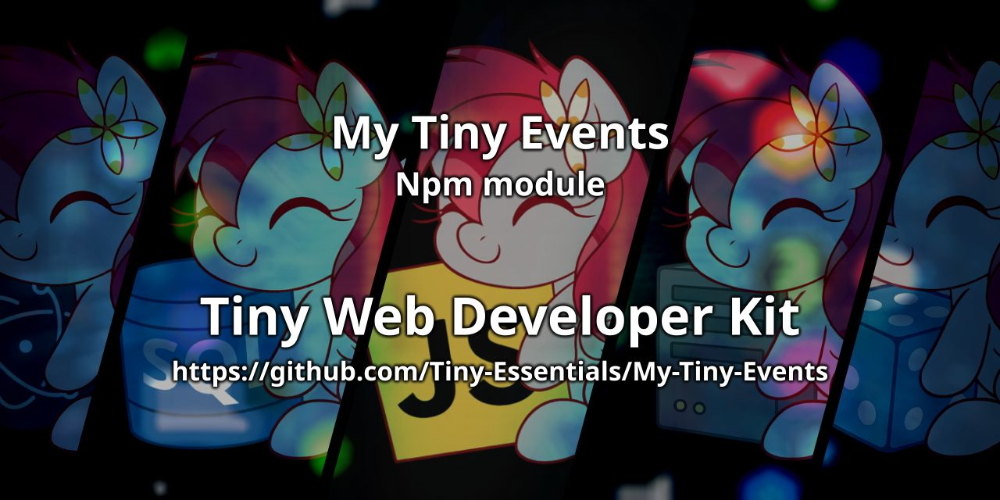

<div align="center">

<p>
    <a href="https://discord.gg/TgHdvJd"></a>
    <a href="https://www.npmjs.com/package/my-tiny-events"></a>
    <a href="https://www.npmjs.com/package/my-tiny-events"></a>
</p>
<p>
    <a href="https://www.patreon.com/JasminDreasond"></a>
    <a href="https://ko-fi.com/jasmindreasond"></a>
    <a href="https://chain.so/address/BTC/bc1qnk7upe44xrsll2tjhy5msg32zpnqxvyysyje2g"></a>
    <a href="https://chain.so/address/LTC/ltc1qchk520v4u8334n5dntmgeja55gc5g5rrkgpd4f"></a>
</p>
<p>
    <a href="https://nodei.co/npm/my-tiny-events/"></a>
</p>
</div>

# 📢 My-Tiny-Events

MyTinyEvents is a lightweight, dependency-free **event emitter system** inspired by Node.js’s native `EventEmitter`. It enables components to subscribe, emit, and manage events and their listeners in a clean, modular, and highly efficient way.

---

## ✨ Features

* **Multi-Event Support:** Register or emit single events (`'data'`) or arrays of events (`['ready', 'init']`) simultaneously. 🚀
* **Flexible Subscriptions:** Easily add or remove listeners using standard methods (`on`, `off`, `offAll`, `offAllTypes`).
* **One-Time Listeners:** Support for executing callbacks exactly once (`once`, `prependListenerOnce`).
* **Execution Control:** Prepend or append listeners to manage execution order precisely.
* **Memory Leak Prevention:** Configure strict or warning-based maximum listener thresholds (`setMaxListeners`, `setThrowOnMaxListeners`). 🛑
* **Deep Inspection:** Fully inspect state via helper methods (`listenerCount`, `listeners`, `onceListeners`, `eventNames`).

---

## 📦 Installation

```bash
npm install my-tiny-events
```

## 📚 Documentation

Looking for detailed module explanations and usage examples?  
Check out the full documentation here:

👉 [Go to docs page](./docs/README.md)

## 🤝 Contributions

Feel free to fork, contribute, and create pull requests for improvements! Whether it's a bug fix or an additional feature, contributions are always welcome.

## 📝 License

This project is licensed under the LGPL-3.0 License - see the [LICENSE](LICENSE) file for details.

> 🧠 **Note**: This documentation was written by [Gemini](https://gemini.google.com/app), an AI assistant developed by Google, based on the project structure and descriptions provided by the repository author.  
> If you find any inaccuracies or need improvements, feel free to contribute or open an issue!

---

## 🔙 Back to Tiny Essentials

Did you like this module? It’s part of the **Tiny Essentials** collection — a set of minimal yet powerful tools to make development easier.
👉 [Click here to explore more Tiny Essentials modules](https://github.com/Tiny-Essentials/Tiny-Essentials)

---

<div align="center">
<a href="./img/"></a>
<br/>
Made with tiny love!
</div>